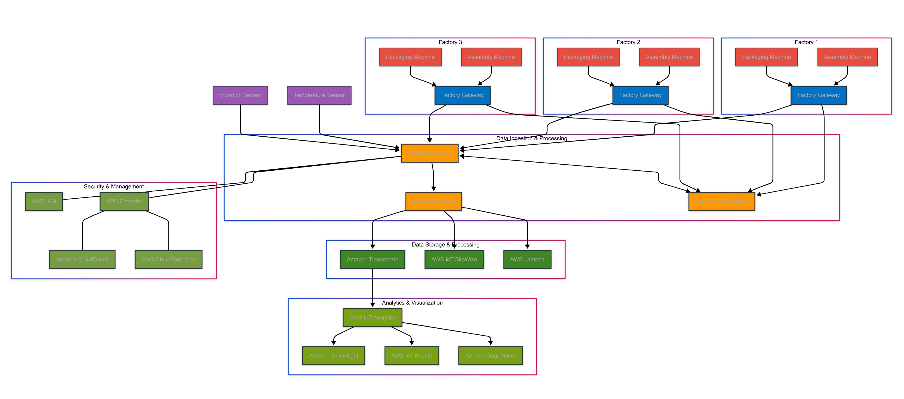

# AWS Solution Architecture Assosiate 

## Overview

This project provides a comprehensive AWS architecture solution. The documentation describes the various AWS services used, their integration, and the overall system design..

## Features

* **Service Category 1**: Description of key AWS services used
* **Service Category 2**: Description of key AWS services used
* **Service Category 3**: Description of key AWS services used
* **Service Category 4**: Description of key AWS services used

## Getting Started

1. **Clone this repository**:

   ```bash
   git clone <your-repo-url>
   cd <your-project-name>
   ```

2. **View the Architecture**:

   * Open the architecture.png file to view the system design
   * Review the documentation for detailed explanations

## File Structure

```
├── main.tex          # LaTeX source with detailed architecture description
├── architecture.png  # Diagram of AWS services and data flows
└── README.md         # Project overview and instructions
```

## Customization

* **Diagram**: Modify the Draw\.io source and re-export `architecture.png` to update the figure.
* **Document**: Edit `main.tex` to add sections, update service details, or adjust formatting.

## License

This project is provided under the MIT License. See [LICENSE](LICENSE) for details.

## Acknowledgments

* AWS Official Documentation for service descriptions and best practices.
* Draw\.io for the AWS icon library.
* Global Manufacturing Inc. for the project scenario.

# AWS Smart Factory Architecture

## Overview

This project provides a comprehensive AWS architecture solution for a smart factory implementation. The solution leverages serverless AWS services to collect, process, store, analyze, and visualize data from factory systems while ensuring security and scalability.

## Architecture Components



### Data Flow

1. **Factory Data Sources**
   * Multiple factories (Factory 1, 2, 3) with client systems
   * Factory Gateways serving as data collection points

2. **Data Ingestion & Processing**
   * **AWS IoT Core**: Manages device connectivity and message routing
   * **Amazon Greengrass**: Extends AWS capabilities to edge devices
   * **Nifi/Minifi**: Facilitates data flow automation and management

3. **Data Storage & Processing**
   * **Amazon Timestream**: Time series database for industrial metrics
   * **Amazon IoT SiteWise**: Service for collecting, organizing, and analyzing industrial equipment data
   * **AWS Lambda**: Serverless compute for event-driven processing

4. **Analytics & Visualization**
   * **Amazon QuickSight**: Business intelligence service for data visualization
   * **AWS IoT Events**: Monitoring service to detect events from IoT sensors
   * **Amazon SageMaker**: Machine learning service for predictive analytics

5. **Security & Management**
   * **AWS IAM**: Identity and access management
   * **VPC Endpoint**: Securely connect VPC to supported AWS services
   * **Amazon GuardDuty**: Threat detection service
   * **AWS CloudFormation**: Infrastructure as code for provisioning

## Benefits

* **Scalability**: Easily scales to support growing data volumes from multiple factories
* **Flexibility**: Accommodates various data sources and processing requirements
* **Reduced Operational Overhead**: Serverless architecture minimizes infrastructure management
* **Real-time Analytics**: Enables immediate insights from factory floor data
* **Enhanced Security**: Comprehensive security controls at every layer

## Implementation Details

### Factory Data Collection

Factory systems connect to Factory Gateways which securely transmit data to the AWS cloud environment. This edge processing allows for local data filtering and preprocessing.

### Cloud Data Pipeline

Once in the AWS cloud, data flows through:
1. **Ingestion Layer**: IoT Core processes incoming messages
2. **Processing Layer**: Real-time data transformation and enrichment
3. **Storage Layer**: Appropriate databases based on data characteristics
4. **Analytics Layer**: Insights generation and visualization

### Security Implementation

The architecture implements:
* Secure communication channels
* Fine-grained access controls
* Continuous monitoring and threat detection
* Data encryption at rest and in transit

## Getting Started

1. **Clone this repository**:

   ```bash
   git clone <your-repo-url>
   cd <your-project-name>
   ```

2. **View the Architecture**:
   * Review architecture.png for the system design
   * Consult documentation for detailed explanations

3. **Deployment**:
   * CloudFormation templates are provided for automated deployment
   * Configure parameters according to your factory requirements

## File Structure

```
├── main.tex          # LaTeX source with detailed architecture description
├── architecture.png  # Diagram of AWS services and data flows
└── README.md         # Project overview and instructions
```

## Customization

* **Diagram**: Modify the Draw\.io source and re-export `architecture.png` to update the figure.
* **Document**: Edit `main.tex` to add sections, update service details, or adjust formatting.

## License

This project is provided under the MIT License. See [LICENSE](LICENSE) for details.

## Acknowledgments

* AWS Official Documentation for service descriptions and best practices.
* Draw\.io for the AWS icon library.
* Global Manufacturing Inc. for the project scenario.

