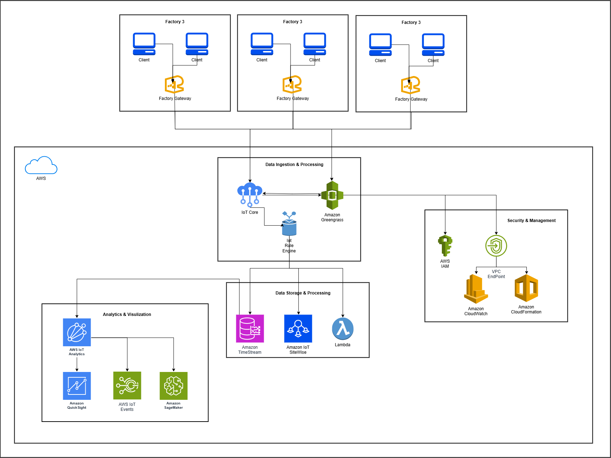

# AWS Solution Architecture Associate - Smart Factory Implementation

**[Solution Architecture Documentation](#architecture-components)** | **[Implementation Guide](#implementation-details)** | **[🚧 Factory Systems Integration](#factory-data-collection)** | **[🔧 Edge Intelligence](#benefits)**

**Note**: This solution provides a comprehensive AWS architecture for implementing a smart factory system using serverless AWS services to collect, process, store, analyze, and visualize data from industrial systems.

## Table of Content

- [Solution Overview](#solution-overview)
- [Architecture Diagram](#architecture-diagram)
- [Architecture Components](#architecture-components)
- [Detailed Service Explanations](#detailed-service-explanations)
- [Benefits](#benefits)
- [Implementation Details](#implementation-details)
  - [Prerequisites](#prerequisites)
  - [Factory Data Collection](#factory-data-collection)
  - [Cloud Data Pipeline](#cloud-data-pipeline)
  - [Security Implementation](#security-implementation)
  - [Monitoring and Maintenance](#monitoring-and-maintenance)
- [Global Manufacturing Inc. Project Scenario](#global-manufacturing-inc-project-scenario)
- [Getting Started](#getting-started)
- [File Structure](#file-structure)
- [Customization](#customization)
- [License](#license)
- [Acknowledgments](#acknowledgments)

# Solution Overview

The Smart Factory Implementation solution helps manufacturing enterprises transition to Industry 4.0 by leveraging serverless AWS services. It provides a comprehensive framework for collecting, processing, analyzing, and visualizing industrial data while ensuring security, scalability, and cost-effectiveness. This solution transitions from an EC2-based proof of concept to a fully serverless AWS architecture that delivers scalable, reliable, and secure operations.

Key architectural principles include:

* **Serverless First**: Managed services auto-scale, minimizing operational overhead.
* **Purpose-Built Data Stores**: Specialized databases (time-series, industrial KPIs) optimize performance and cost.
* **Edge Intelligence**: Local preprocessing at gateways reduces latency, conserves bandwidth, and supports offline resilience.
* **Security by Design**: Fine-grained identity, encryption, and private networking at every layer.
* **Infrastructure as Code**: Version-controlled templates ensure consistent, repeatable deployments.
* **Real-Time Insights**: Instant data processing, visualization, and anomaly detection for rapid decision-making.

For more details and a complete implementation guide, visit the solution documentation.

# Architecture Diagram



# Architecture Components

The AWS CloudFormation template deploys a complete serverless architecture for smart factory implementation. The solution includes the following data flow components:

1. **Data Sources**
   * Multiple factories with client systems
   * Factory Gateways serving as data collection points
   * Industrial IoT sensors and control systems (PLC, SCADA, MES)

2. **Data Ingestion & Processing**
   * **AWS IoT Core**: Manages device connectivity and message routing with MQTT support
   * **Amazon Greengrass**: Extends AWS capabilities to edge devices for local processing
   * **Nifi/Minifi**: Facilitates data flow automation and management
   * **Amazon Kinesis**: Real-time data streaming for high-volume sensor data

3. **Data Storage & Processing**
   * **Amazon Timestream**: Time series database for industrial metrics and sensor readings
   * **Amazon IoT SiteWise**: Service for collecting and analyzing industrial equipment data
   * **AWS Lambda**: Serverless compute for event-driven processing
   * **Amazon S3**: Object storage for raw data and processed analytics results
   * **Amazon DynamoDB**: NoSQL database for device metadata and configuration

4. **Analytics & Visualization**
   * **Amazon QuickSight**: Business intelligence service for data visualization
   * **AWS IoT Analytics**: Advanced analytics toolset for IoT data
   * **AWS IoT Events**: Monitoring service to detect events from IoT sensors
   * **Amazon SageMaker**: Machine learning service for predictive maintenance and quality control

5. **Security & Management**
   * **AWS IAM**: Identity and access management with role-based access control
   * **VPC Endpoint**: Securely connect VPC to supported AWS services
   * **Amazon GuardDuty**: Threat detection service with continuous monitoring
   * **AWS CloudFormation**: Infrastructure as code for provisioning
   * **AWS Secrets Manager**: Secure storage of credentials and API keys
   * **AWS Certificate Manager**: SSL/TLS certificate management

# Detailed Service Explanations

### AWS IoT Greengrass
Extends AWS cloud capabilities to on-premises gateways, enabling local execution of Lambda functions, secure component updates, and ML inference at the edge—even when connectivity is intermittent.

### AWS IoT Core & Rules Engine
Provides a fully managed MQTT broker with device registry and shadows, plus a serverless Rules Engine for SQL-like filtering and routing of messages to AWS targets (Lambda, Timestream, SiteWise, SNS, etc.) without custom code.

### Amazon Timestream
A serverless, purpose-built time-series database that ingests and stores trillions of events per day. It offers built-in time-series functions (interpolation, smoothing) and tiered storage (in-memory vs. magnetic) for optimized cost and performance.

### AWS IoT SiteWise
Manages industrial telemetry at scale, creating digital twins of assets and computing operational metrics (e.g., OEE) in real time. Prebuilt gateways and Greengrass connectors automate ingestion from OPCUA, Modbus, and MQTT devices.

### AWS Lambda & AWS IoT Analytics
Lambda functions handle event-driven data transformations—unit conversions, context enrichment, validation—triggered by IoT Core rules. IoT Analytics orchestrates scalable ETL pipelines (channels, pipelines, data stores) for cleansing and preparing data for ML and BI.

### Amazon QuickSight & AWS IoT Events
QuickSight is a cloud-native BI service with direct Timestream and SiteWise connectors, auto-scaling to thousands of users for live dashboards. IoT Events continuously evaluates data streams against state-machine detectors, triggering alerts and automated workflows on anomalies.

### Amazon SageMaker
Delivers end-to-end machine learning: data labeling, training, tuning, and low-latency inference endpoints. Integrated with Timestream for predictive maintenance models, allowing proactive servicing based on forecasted failure windows.

### Security & Management
* **AWS IAM**: Fine-grained roles and policies enforce least-privilege access for devices, services, and users.
* **VPC Endpoints (PrivateLink)**: Private connectivity to AWS services without traversing the public internet.
* **Amazon CloudWatch**: Centralized logs, metrics, dashboards, and alarms; integrates with EventBridge for automated responses.
* **AWS CloudFormation & CDK**: IaC frameworks for defining, provisioning, and version-controlling all resources with change-set previews and drift detection.

# Benefits

* **Scalability**: Easily scales to support growing data volumes from multiple factories
* **Flexibility**: Accommodates various data sources and processing requirements
* **Reduced Operational Overhead**: Serverless architecture minimizes infrastructure management
* **Real-time Analytics**: Enables immediate insights from factory floor data
* **Enhanced Security**: Comprehensive security controls at every layer
* **Cost Optimization**: Pay-as-you-go pricing model with auto-scaling capabilities
* **Reliability**: Multi-AZ deployment for high availability and disaster recovery

# Implementation Details

## Prerequisites

* AWS Account with appropriate permissions
* AWS CLI configured with access keys
* Basic knowledge of CloudFormation and AWS services

## Factory Data Collection

Factory systems connect to Factory Gateways which securely transmit data to the AWS cloud environment. This edge processing allows for local data filtering and preprocessing.

## Cloud Data Pipeline

Once in the AWS cloud, data flows through:
1. **Ingestion Layer**: IoT Core processes incoming messages with rules engine for routing
2. **Processing Layer**: Real-time data transformation and enrichment via Lambda and AWS Glue
3. **Storage Layer**: Appropriate databases based on data characteristics and query patterns
4. **Analytics Layer**: Insights generation and visualization with built-in machine learning capabilities

## Security Implementation

The architecture implements:
* Secure communication channels with TLS 1.2+
* Fine-grained access controls using IAM policies
* Continuous monitoring and threat detection via CloudTrail and GuardDuty
* Data encryption at rest and in transit with KMS-managed keys
* Network security with VPC security groups and NACLs

## Monitoring and Maintenance

* **AWS CloudWatch**: Real-time monitoring of services and custom metrics
* **AWS X-Ray**: Distributed tracing for performance optimization
* **AWS Config**: Continuous assessment, auditing, and compliance monitoring
* **AWS Systems Manager**: Automated patch management and configuration

# Global Manufacturing Inc. Project Scenario

Global Manufacturing Inc. leverages this serverless AWS architecture across three factories to shift from reactive maintenance to proactive optimization:

1. **Edge Data Collection**: Greengrass cores on factory gateways host Lambda OPCUA and MQTT adapters, buffering data locally and performing initial validation.
2. **Secure Ingestion & Routing**: Gateways and sensors authenticate via IoT Core with X.509 certificates. Rules Engine routes telemetry to Timestream, raw streams to IoT Analytics, and machine states to SiteWise.
3. **Data Enrichment & Storage**: Lambda enriches streams with metadata (factory ID, machine type), converts units, and validates before storage. SiteWise computes OEE and downtime metrics via digital twin models.
4. **Analytics, Visualization & Alerts**: IoT Analytics pipelines clean and prepare data for ML. QuickSight dashboards display real-time and historical KPIs. IoT Events detectors trigger maintenance alerts on anomalies.
5. **Predictive Maintenance**: SageMaker training jobs use historical Timestream data and context tags to build models predicting failure windows. Deployed endpoints provide real-time inference for maintenance planning.
6. **Governance & Automation**: CloudFormation/CDK scripts provision all resources. IAM policies enforce least privilege. VPC Endpoints secure service traffic. CloudWatch monitors system health and scales analytics pipelines as needed.

This comprehensive approach empowers Global Manufacturing Inc. to achieve an Industry 4.0–ready, smart factory ecosystem with minimal operational overhead and maximum uptime.

# Getting Started

1. **Clone this repository**:

   ```bash
   git clone git@github.com:MohmedADesouky/AWS-Solutions-Architect---Associate.git
   cd AWS-Solutions-Architect---Associate
   ```

2. **View the Architecture**:
   * Review architecture.png for the system design
   * Consult documentation for detailed explanations

3. **Deployment**:
   * CloudFormation templates are provided for automated deployment
   * Configure parameters according to your factory requirements:

   ```bash
   aws cloudformation deploy \
     --template-file templates/main-stack.yaml \
     --stack-name smart-factory-production \
     --parameter-overrides EnvironmentType=Production \
     --capabilities CAPABILITY_IAM
   ```

# File Structure

```
├── Smart_Factory_Architecture__Serverless_AWS_Solution.pdf  # Detailed architecture description
├── architecture.png                                         # Diagram of AWS services and data flows
└── README.md                                                # Project overview and instructions
```

# Customization

* **Diagram**: Modify the Draw.io source and re-export `architecture.png` to update the figure.
* **Document**: Edit source files to add sections, update service details, or adjust formatting.

# License

This project is provided under the MIT License. See [LICENSE](LICENSE) for details.

# Acknowledgments

* AWS Official Documentation for service descriptions and best practices
* Draw.io for the AWS icon library
* Global Manufacturing Inc. for the project scenario